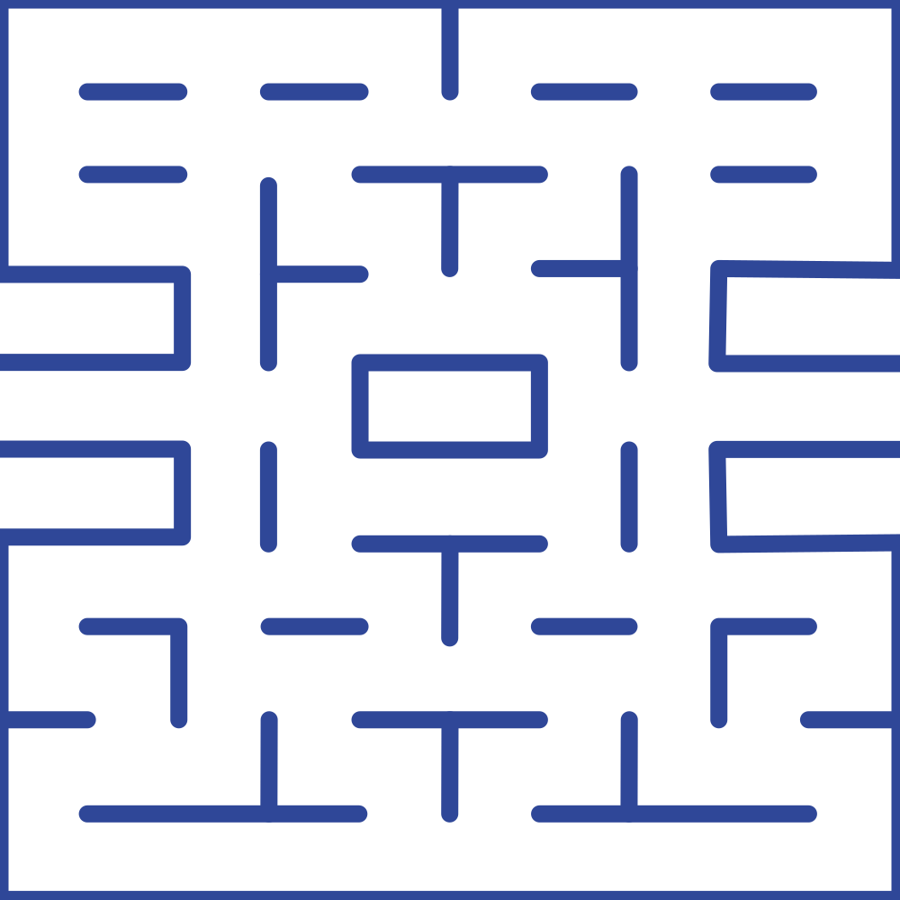

# Vanilla Pac-Man

## 10 points pour le 24/02/2020

1. Trois fantômes bougeant de manière aléatoire (0,5 pt).
1. Au début, un `input` permet de rentrer un nom. À la validation de l’`input`, la carte s’affiche et le jeu démarre. (3 pt)
1. Maquettes XD *desktop* + *mobile* (3 pts)
1. Un Pag-Gomme rapporte un point (3,5 pt)

## Cahier des charges

Le travail sera réalisé en binôme et des maquettes seront à rendre, pour le *desktop* et le mobile

### Produit minimum viable

1. Site en ligne
1. Navigable au clavier
1. Création d’un pseudo au l’affichage de la page
1. Le score est enregistré en base de données
1. Présence d’un tableau des scores
1. Niveau 1 (les trois fantômes se déplacent de façon aléatoire)
1. Responsive :
    1. *desktop* navigable au clavier,
    1. mobile navigable à la croix multidirectionnelle
1. Les fantômes mangent 

### Améliorations possible

1. Niveau 2 (un fantôme pourchasse Pac-Man)
1. Niveau 3 (deux fantôme pourchassent Pac-Man)
1. Niveau 4 (trois fantôme pourchassent Pac-Man)
1. Bonbons (et cerises ?) qui donnent des super pouvoirs à Pac-Man
1. Mise en pause en appuyant sur la barre d’espace
1. Finir le déplacement du fantôme :
    1. Le fantôme rouge ne va pas dans la direction d’où il vient
    1. Le fantôme rouge ne va pas dans une direction où il est bloqué

## Structure du projet

Notre projet est structuré comme suit et tout le JS que nous écrirons sera dans `main.js` :

<pre>
pacman/
├── img/
│    ├── background.svg
│    ├── red-ghost.png
│    └── pacman.gif
├── index.html
├── <strong style="color:#c22;">main.js</strong>
└── style.css
</pre>

### Contenu de l’index.html

```html
<!DOCTYPE html>
<html lang="fr-FR">
<head>
    <meta charset="UTF-8">
    <title>Vanilla Pac-Man</title>
    <link rel="stylesheet" href="assets/style.css">
</head>
<body>
    <div class="map">
        
        
        
    </div>
    <script src="assets/main.js"></script>
</body>
</html>
```

### Contenu de style.css

```css
.map {
    background-color: #0b0b0b;
    width: 1000px;
    height: 1000px;
    position: relative;
}

img[src="./img/pacman.gif"] {
    position: absolute;
    top: 500px;
    left: 500px;
}
img[src="./img/red-ghost.png"] {
    position: absolute;
    top: 300px;
    left: 400px;
    width: 100px;
}
img[src="./img/background.svg"] {
    position: absolute;
    top: 0;
    left: 0;
    width: 1000px;
    height: 1000px;
}

.dot {
    position: absolute;
    width: 100px;
    height: 100px;
    display: flex;
    justify-content: center;
    align-items: center;
    background-color: transparent;
}
.dot::before {
    content: "";
    width: 20px;
    height: 20px;
    border-radius: 50%;
    background-color: #ff6;
}

.toLeft {
    transform: none;
}
.toTop {
    transform: rotate(90deg);
}
.toRight {
    transform: scale(-1, 1);
}
.toBottom {
    transform: rotate(-90deg);
}
```

## Le DOM

Chaque onglet du navigateur contient l’objet `window` qui contient lui-même l’objet `document` qui est le document `.html` affiché dans le *viewport*. 

L’objet `document` est le point d’entrée du *document object model* (DOM), une API JS.

C’est le DOM que le navigateur nous affiche dans son inspecteur d’éléments et il est représenté sous la forme d’un *arbre* HTML. Chaque élément HTML y est un nœud et bénéficie de propriétés et de méthodes.

### Accéder à un nœud du DOM

L’objet `document` possède deux méthodes pour accéder à un nœud du DOM :

1. `.querySelector()` prend un sélecteur CSS en argument et retourne le premier nœud du DOM correspondant à ce sélecteur,
1. `.querySelectorAll()` prend un sélecteur CSS en argument et retourne une `NodeList` de tous les nœuds correspondant à ce sélecteur.

`NodeList` (une liste de nœud) est une collection d’éléments HTML, c’est une collection tout comme `Array` (un tableau) et bénéficie de certaines propriétés et méthodes des tableaux.

Cependant, ce n’est pas un tableau et pour l’utiliser comme un vrai tableau il nous faurait d’abord le convertir en le passant en argument du constructeur `Array.from()`.

Pour commencer, nous allons référencer l’image de Pac-Man affichée dans le navigateur. Ainsi, nous pourrons le piloter en JS !

## Référencer Pac-Man

Nous accédons à Pac-Man pour le stocker dans une constante comme ceci :

```js
const pacMan = document.querySelector('img[src="./img/pacman.gif"]')
```

Pour le piloter à l’intérieur de la carte, nous avons besoin d’obtenir sa position à l’intérieur de celle-ci.

## Obtenir la position d’un élément

Au cours du jeu, nous n’aurons pas seulement besoin d’obtenir la position de Pac-Man, mais également celles :

1. des Pac-Gommes que Pac-Man doit gober,
1. des fantômes qui poursuivront Pac-Man.

Pour cela, nous créons une fonction :

1. qui prend en argument un des éléments positionnés en `absolute`,
1. qui obtient les propriétés CSS `top` et `left` de cet élément avec les méthodes globales :
    1. `getComputedStyle().getPropertyValue()`,
    1. `getComputedStyle().getPropertyValue()`
1. et qui retourne la position de cet dans un objet aux propriétés `top` et `left` sous la forme d’un nombre entier.

Cette fonction permet d’obtenir la position de n’importe quel élément positionné en `absolute` :

```js
const getPositionOf = (element) => {
    const top = parseInt(getComputedStyle(element, null).getPropertyValue('top'), 10)
    const left = parseInt(getComputedStyle(element, null).getPropertyValue('left'), 10)
    return { top, left }
}
```

Puisque les propriétés CSS `top` et `left` des éléments positionnés en `absolute` ont des valeurs exprimées en `px` (ex. : `500px`), nous devions convertir ces valeurs en nombres entiers avant de les stocker dans les propriétés `top` et `left` de l’objet de retour.

C’est pour effectuer ces conversions que nous avons utilisé la fonction globale `parseInt()` :

1. qui prend prend en arguments :
    1. une valeur du genre `500px`,
    1. le nombre `10` pour un être dans le système décimal (des nombres construits avec les dix chiffres de 0 à 9),
1. et qui retourne alors le nombre entier `500`.

Nous effectuons cette conversion :
1. parce que `500px` qui est une chaîne de caractères ne permet pas de faire des calculs,
1. alors que nous pourrons par exemple ajouter ou soustraire `100` à `500`.

## Déplacer Pac-Man

Nous déclarons la fonction `movePacMan()` dont le paramètre `to` sera une chaîne de caractère désignant la direction du déplacement et qui vaudra soit `toLeft`, `toRight`, `toBottom`, `toTop`.

```js
const movePacMan = (to) => {
    // Orienter Pac-Man
    pacMan.className = to

    // Obtenir la position de Pac-Man
    const pacManPosition = getPositionOf(pacMan)

    // Évaluer la direction et déplacer Pac-Man en conséquences
    switch (to) {
        case 'toLeft':
            // Si Pac-Man est au bord gauche situé à 0px 
            // nous le ramenons au bord droit situé à 900px,
            // sinon nous le déplaçons de 100px vers la gauche
            pacMan.style.left = pacManPosition.left === 0 ? 900 + "px" : 
                pacManPosition.left - 100 + "px"
            break

        case 'toRight':
            // Si Pac-Man est au bord droit situé à 900px 
            // nous le ramenons au bord gauche situé à 0px,
            // sinon nous le déplaçons de 100px vers la droite
            pacMan.style.left = pacManPosition.left === 900 ? 0 : 
                pacManPosition.left + 100 + "px"
            break

        case 'toTop':
            // Nous déplaçons Pac-Man de 100px vers le haut
            pacMan.style.top = pacManPosition.top - 100 + "px"
            break

        case 'toBottom':
            // Nous déplaçons Pac-Man de 100px vers le bas
            pacMan.style.top = pacManPosition.top + 100 + "px"
            break
    }
}
```

Pour déplacer Pac-Man avec le clavier :

1. nous écoutons l’événement `'keydown'` qui est déclenché à chaque pression d’une touche du clavier,
1. nous évaluons le `keyCode` qui correspond à une touche,
1. quand le `keyCode` de l’événement vaut `37`, `39`, `38` et `40`, ce sont respectivement les flèches de gauche, de droite, du haut et du bas qui ont été pressées.

À la pression de chacune de ces quatre touches, nous lançons la fonction `movePacMan()` précédemment créée et nous lui donnons en arguments :

1. `pacMan`, le personnage à déplacer,
1. soit `'toLeft'`, `'toRight'`, `'toTop'` ou `'toBottom'`, la direction vers laquelle le personnage se déplace.

```js
addEventListener('keydown', e => {
    switch (e.keyCode) {
        case 37:
            movePacMan('toLeft')
            break
        case 39:
            movePacMan('toRight')
            break
        case 38:
            movePacMan('toTop')
            break
        case 40:
            movePacMan('toBottom')
            break
    }
})
```

## Bloquer Pac-Man aux murs

Nous référençons :

1. les positions des cases bloquées par un mur quand un personnage se déplace vers la gauche,
1. les positions des cases bloquées par un mur quand un personnage se déplace vers la droite,
1. les positions des cases bloquées par un mur quand un personnage se déplace vers le haut,
1. les positions des cases bloquées par un mur quand un personnage se déplace vers le bas.

Nous relevons les positions de ces cases sur la carte, puis nous les stockons dans quatre tableaux :

```js
const blockedSquaresToLeft = []
const blockedSquaresToRight = []
const blockedSquaresToTop = []
const blockedSquaresToBottom = []
```

Ensuite, nous créons une fonction :

1. qui prend les paramètres :
    1. `characterPosition`, la position d’un personnage,
    1. `movingDirection`, la direction vers laquelle un personnage tente de se diriger ce personnage
1. et qui retourne `true` si un personnage est bloqué par un mur quand il tente de se déplacer dans une direction.

Nous nommons cette fonction `isTheCharacterBlocked()` :

```js
const isTheCharacterBlocked = (characterPositon, movingDirection) => {
    // Nous déterminons quel tableau est concerné par la direction prise
    let blockedSquares
    switch (movingDirection) {
        case 'toLeft':
            blockedSquares = blockedSquaresToLeft
            break
        case 'toRight':
            blockedSquares = blockedSquaresToRight
            break
        case 'toTop':
            blockedSquares = blockedSquaresToTop
            break
        case 'toBottom':
            blockedSquares = blockedSquaresToBottom
            break
    }

    // Nous retournons un booléen indiquant si la position du personnage 
    // est référencéE dans le tableau
    return blockedSquares.some(square => {
        const topsAreEquals = characterPositon.top === square.top
        const leftsAreEquals = characterPositon.left === square.left
        return topsAreEquals && leftsAreEquals
    })
}
```

Nous modifions maintenant la fonction `movePacMan()` précédemment créée en n’exécutant le mouvement que si le personnage n’est pas bloqué par un mur :

```js
const movePacMan = (to) => {
    pacMan.className = to
    const pacManPosition = getPositionOf(pacMan)

    // Le personnage ne bougera que s’il n’est pas bloqué contre un mur
    if (!isTheCharacterBlocked(pacManPosition, to)) {
        switch (to) {
            case 'toLeft':
                    pacMan.style.left = pacManPosition.left === 0 ? 900 + "px" : 
                        pacManPosition.left - 100 + "px"
                    break
            case 'toRight':
                pacMan.style.left = pacManPosition.left === 900 ? 0 : 
                    pacManPosition.left + 100 + "px"
                break
            case 'toTop':
                pacMan.style.top = pacManPosition.top - 100 + "px"
                break
            case 'toBottom':
                pacMan.style.top = pacManPosition.top + 100 + "px"
                break
        }
    }
}
```

## Faire avancer Pac-Man en continu

Pour l’instant, Pac-Man n’avance que d’une case quand nous appuyons sur une touche de direction du clavier.

Maintenant, il faudrait qu’il avance tout droit à l’appui d’une touche et qu’il ne s’arrête jusqu’à rencontrer un mur.

Nous pourrions remplacer l’instruction conditionnelle `if` par une boucle `while` comme ceci :

```js
const movePacMan = (to) => {
    pacMan.className = to

    // La constante characterPosition devient une variable 
    // pour que sa valeur puisse être réinitialisée 
    // à chaque itération de la boucle
    let pacManPosition = getPositionOf(pacMan)

    while (!isTheCharacterBlocked(pacManPosition, to)) {
        switch (to) {
            case 'toLeft':
                pacMan.style.left = pacManPosition.left === 0 ? 900 + "px" : 
                    pacManPosition.left - 100 + "px"
                break
            case 'toRight':
                pacMan.style.left = pacManPosition.left === 900 ? 0 : 
                    pacManPosition.left + 100 + "px"
                break
            case 'toTop':
                pacMan.style.top = pacManPosition.top - 100 + "px"
                break
            case 'toBottom':
                pacMan.style.top = pacManPosition.top + 100 + "px"
                break
        }

        // La position du personnage est recalculée à la fin de chaque itération de while
        pacManPosition = getPositionOf(pacMan)
    }
}
```

Cependant, le résultat n’est pas satisfaisant puisque Pac-Man passe d’un seul coup de sa position de départ à sa position d’arrivée.

Nous allons effectuer chaque déplacement de `100px` par interval de 250 ms, avec la méthode globale `setInterval()` qui prendra en arguments :

1. une fonction pour déplacer Pac-Man,
1. `250`, les millisecondes entre chaque intervalle.

```js
const movePacMan = (to) => {
    pacMan.className = to
    let pacManPosition = getPositionOf(pacMan)

    setInterval(() => {
        if (!isTheCharacterBlocked(pacManPosition, to)) {
            switch (to) {
                case 'toLeft':
                    pacMan.style.left = pacManPosition.left === 0 ? 900 + "px" : 
                        pacManPosition.left - 100 + "px"
                    break
                case 'toRight':
                    pacMan.style.left = pacManPosition.left === 900 ? 0 : 
                        pacManPosition.left + 100 + "px"
                    break
                case 'toTop':
                    pacMan.style.top = pacManPosition.top - 100 + "px"
                    break
                case 'toBottom':
                    pacMan.style.top = pacManPosition.top + 100 + "px"
                    break
            }
            pacManPosition = getPositionOf(pacMan)
        }
    }, 250)
}
```

Pac-Man avance en continu, mais si nous souhaitons le faire changer de direction en cours de route, le résultat est déconcertant : il a tendance à sauter en diagonale sans s’arrêter

## Changer de direction

Nous commençons par déclarer une variable en haut de `main.js`, en dessous de la déclaration de la constante `pacMan` et sans en initialiser sa valeur :

```js
let pacManMovingInterval
```

Dans la fonction `movePacMan()` :
1. nous initialisons la variable `pacManMoving` en lui donnant la valeur du `setInterval()`,
1. au début de la fonction, nous commençons par annuler avec la méthode globale `clearInterval()` les `setInterval()` qui auraient été lancés précédemment

```js
const move = (character, to) => {
    // Suppresion d’éventuels mouvements résiduels de pacMan
    clearInterval(pacManMovingInterval)
    
    character.className = to
    let characterPosition = getPositionOf(character)

    pacManMovingInterval = setInterval(() => {
        if (!isTheCharacterBlocked(characterPosition, to)) {
            switch (to) {
                case 'toLeft':
                    character.style.left = characterPosition.left === 0 ? 900 + "px" : 
                        characterPosition.left - 100 + "px"
                    break
                case 'toRight':
                    character.style.left = characterPosition.left === 900 ? 0 : 
                        characterPosition.left + 100 + "px"
                    break
                case 'toTop':
                    character.style.top = characterPosition.top - 100 + "px"
                    break
                case 'toBottom':
                    character.style.top = characterPosition.top + 100 + "px"
                    break
            }
            characterPosition = getPositionOf(character)
        }
    }, 250)
}
```
